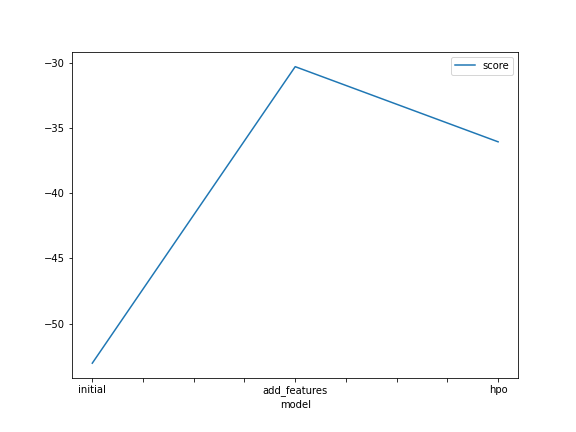
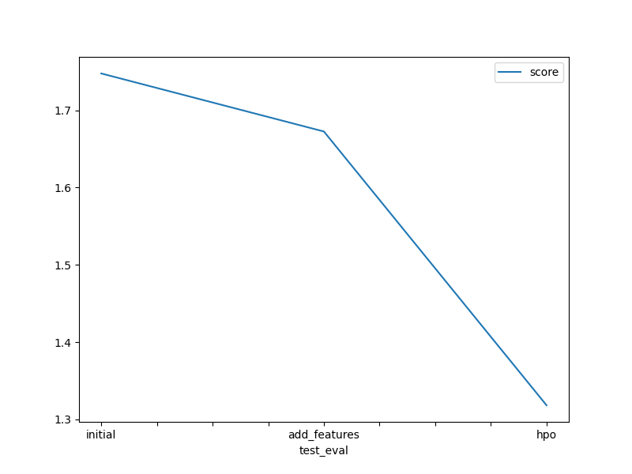

# Report: Predict Bike Sharing Demand with AutoGluon Solution
#### HASSAN MAHAMAT DJIDDA

## Initial Training
### What did you realize when you tried to submit your predictions? What changes were needed to the output of the predictor to submit your results?
I realized that kaggle didn't accept negative number when I tried to submit.I needed to normalize the output of the predictor to 0 before submitting.

### What was the top ranked model that performed?
The WeightedEnsembleL3 model.

## Exploratory data analysis and feature creation
### What did the exploratory analysis find and how did you add additional features?
I found that the date and time have more influence on the odel prediction.So I created more additional features from the datetime feature.

### How much better did your model preform after adding additional features and why do you think that is?
The model performance has a litle bit increased.

## Hyper parameter tuning
### How much better did your model preform after trying different hyper parameters?
After I tuned the model hyper parameters the score has a little bit decreased .

### If you were given more time with this dataset, where do you think you would spend more time?
I will expend more time on the EDA and the feature engineering process.

### Create a table with the models you ran, the hyperparameters modified, and the kaggle score.
|model|hpo1|hpo2|hpo3|score|
|--|--|--|--|--|
|initial|8|3|1|1.76|
|add_features|8|3|1|1.67|
|hpo|9|3|10|1.31|

### Create a line plot showing the top model score for the three (or more) training runs during the project.

### Create a line plot showing the top kaggle score for the three (or more) prediction submissions during the project.

## Summary
At the end, I noticed that the weightedEnsembleL3 model performs well than the other models, adding new features and doing some hyperparameters tuning improve the model performance.

